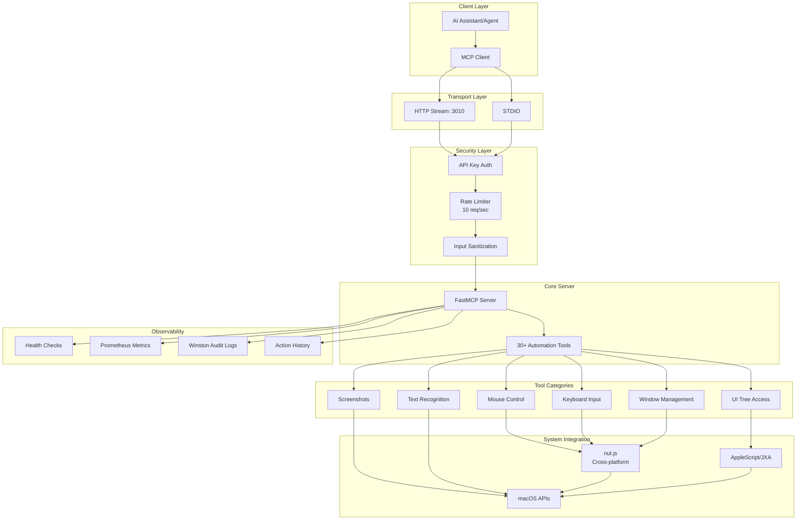
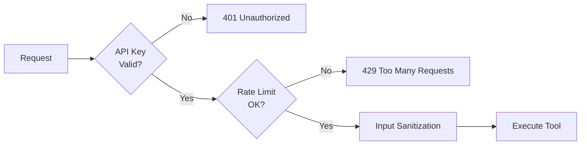
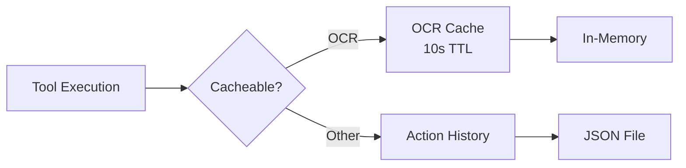
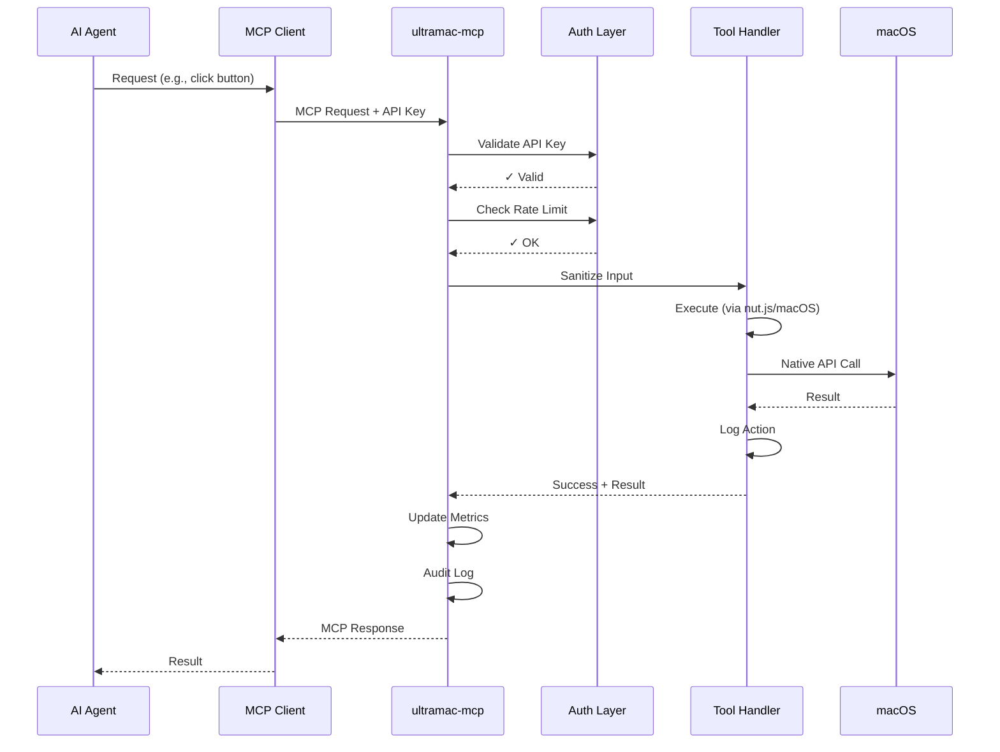
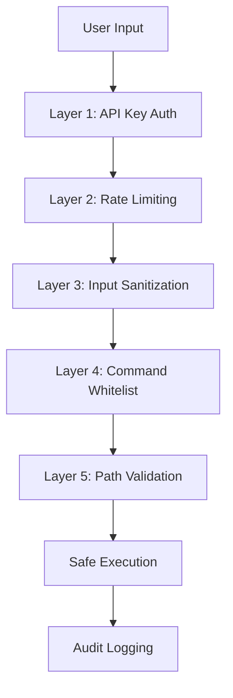

# Architecture Overview

## System Design

ultramac-mcp is a Model Context Protocol (MCP) server providing complete desktop automation capabilities on macOS through AI-accessible tools.



## Component Architecture

### 1. Transport Layer (FastMCP)

- **HTTP Stream** (port 3010): Server-Sent Events for web clients
- **STDIO**: Standard I/O for CLI tools and direct integrations
- Protocol: Model Context Protocol (MCP) specification

### 2. Security Layer



**Components:**

- **API Key Validation** (`src/auth.ts`): Validates `umcp_*` keys
- **Rate Limiter** (`src/security-utils.ts`): Token bucket, 10 req/sec
- **Input Sanitization** (`src/security-utils.ts`):
  - Command whitelist
  - Path validation
  - Shell metacharacter removal

### 3. Tool Execution Layer

**30+ Tools organized by category:**

| Category   | Tools                                      | Implementation          |
| ---------- | ------------------------------------------ | ----------------------- |
| Mouse      | click, move, drag, scroll, doubleClick     | nut.js + macOS APIs     |
| Keyboard   | type, keyPress, systemCommand              | nut.js + AppleScript    |
| Window     | getWindows, windowControl, getActiveWindow | get-windows + JXA       |
| Screenshot | screenshot (full/region/window)            | screencapture CLI       |
| UI         | get_ui_tree, find_element, click_element   | macOS Accessibility API |
| OCR        | find_text_on_screen, performOCR            | Tesseract.js            |
| Visual     | find_icon                                  | Transformers.js (AI)    |
| Meta       | health, metrics, get_action_history        | Internal                |

### 4. Caching & History



**Components:**

- **OCR Cache** (`src/ocr-cache.ts`): 10-second TTL, in-memory
- **Action Logger** (`src/action-logger.ts`): Persistent JSON history

### 5. Observability

```mermaid
graph TB
    EXEC[Tool Execution] --> LOG[Audit Logger]
    EXEC --> METRICS[Prometheus Metrics]
    EXEC --> HISTORY[Action History]

    LOG --> WINSTON[Winston<br/>JSON Logs]
    METRICS --> PROM[prom-client<br/>8 Metrics]
    HISTORY --> JSON[~/.ultramac-mcp/history.json]

    WINSTON --> DISK[~/.ultramac-mcp/logs/]
    PROM --> ENDPOINT[/metrics endpoint]
```

**Metrics Collected:**

- Tool invocation counts (by tool, status)
- Execution duration histograms
- Auth attempts (success/failure)
- Rate limit violations
- Active connections
- Error counts (by type, tool)
- Cache sizes (action history, OCR)

## Data Flow

### Typical Request Flow



## Technology Stack

| Layer             | Technology      | Version |
| ----------------- | --------------- | ------- |
| **Runtime**       | Bun             | 1.3+    |
| **Language**      | TypeScript      | 5.x     |
| **MCP Framework** | FastMCP         | Latest  |
| **Automation**    | nut.js          | Latest  |
| **OCR**           | Tesseract.js    | Latest  |
| **AI/ML**         | Transformers.js | Latest  |
| **Logging**       | Winston         | 3.19.0  |
| **Metrics**       | prom-client     | 15.1.3  |
| **Testing**       | Vitest          | Latest  |
| **Container**     | Docker (Alpine) | Latest  |

## Security Architecture

### Defense in Depth



**Layers:**

1. **Authentication**: API key validation, client identification
2. **Rate Limiting**: 10 req/sec per client, sliding window
3. **Input Sanitization**: Shell metacharacter removal
4. **Command Whitelist**: Only screencapture, osascript, system_profiler
5. **Path Validation**: Only /tmp, user home, /var/tmp
6. **Audit Logging**: All actions logged with timestamps

### Threat Model

| Threat              | Mitigation                             |
| ------------------- | -------------------------------------- |
| Command Injection   | Command whitelist + input sanitization |
| Directory Traversal | Path whitelist + resolution check      |
| Rate Limiting Abuse | Token bucket (10 req/sec)              |
| Unauthorized Access | API key validation                     |
| Data Exfiltration   | Audit logging + access controls        |
| Resource Exhaustion | Rate limiting + Docker resource limits |

## Deployment Architecture

### Docker Deployment

```mermaid
graph TB
    subgraph "Container"
        APP[ultramac-mcp<br/>Alpine Linux]
        LOGS[/home/ultramac/.ultramac-mcp/logs]
        HISTORY[/home/ultramac/.ultramac-mcp/history]
    end

    subgraph "Volumes"
        VLOGS[logs volume]
        VHISTORY[history volume]
    end

    subgraph "Monitoring"
        PROM[Prometheus<br/>Scrapes :3010/metrics]
        ALERTS[Alertmanager]
    end

    CLIENT[MCP Clients] -->|:3010| APP
    APP --> VLOGS
    APP --> VHISTORY
    VLOGS --> LOGS
    VHISTORY --> HISTORY
    PROM -->|Scrape| APP
    PROM --> ALERTS
```

**Container Specs:**

- Base: Alpine Linux (minimal)
- User: non-root (ultramac:ultramac)
- Security: no-new-privileges, read-only filesystem
- Resources: 1GB memory limit, 2 CPU cores
- Health: HEALTHCHECK every 30s

### Kubernetes Deployment (Optional)

```yaml
apiVersion: apps/v1
kind: Deployment
metadata:
  name: ultramac-mcp
spec:
  replicas: 2
  template:
    spec:
      containers:
        - name: ultramac-mcp
          image: ghcr.io/jxoesneon/ultramac-mcp:latest
          ports:
            - containerPort: 3010
          livenessProbe:
            httpGet:
              path: /liveness
              port: 3010
          readinessProbe:
            httpGet:
              path: /readiness
              port: 3010
          resources:
            limits:
              memory: "1Gi"
              cpu: "2"
            requests:
              memory: "256Mi"
              cpu: "500m"
```

## Scalability Considerations

### Current Limitations

- **Desktop Automation**: Requires GUI access (not horizontally scalable)
- **macOS Only**: Platform-specific APIs
- **Stateful**: Action history tied to instance

### Scaling Strategies

**Vertical Scaling:**

- Increase container resources
- More CPU for image processing (OCR, AI)
- More memory for caching

**Deployment Patterns:**

1. **Single Instance**: Development, small teams
2. **Multi-Instance**: Load balancer + session affinity
3. **Federation**: Multiple macOS hosts, tool-based routing

## Performance Characteristics

| Operation      | Typical Duration | Notes             |
| -------------- | ---------------- | ----------------- |
| Mouse click    | <10ms            | Native API        |
| Keyboard input | <20ms            | Native API        |
| Screenshot     | 50-100ms         | Disk I/O          |
| OCR (cached)   | <1ms             | In-memory         |
| OCR (uncached) | 200-500ms        | Tesseract         |
| UI Tree        | 50-150ms         | Accessibility API |
| Find Icon (AI) | 500-2000ms       | ML inference      |
| Health Check   | <10ms            | Cached            |
| Metrics        | <5ms             | Prometheus        |

## Extension Points

### Adding New Tools

```typescript
server.addTool({
  name: "my_custom_tool",
  description: "Description for AI",
  schema: {
    type: "object",
    properties: {
      /* Zod schema */
    },
    required: [],
  },
  execute: async (args) => {
    // 1. Validate/sanitize input
    // 2. Execute logic
    // 3. Log action
    // 4. Return result
  },
});
```

### Custom Metrics

```typescript
import { Counter } from "prom-client";
import { register } from "./src/metrics";

const myMetric = new Counter({
  name: "ultramac_mcp_custom_metric",
  help: "Description",
  registers: [register],
});

myMetric.inc(); // Increment
```

## References

- [FastMCP Documentation](https://github.com/jlowin/fastmcp)
- [Model Context Protocol Spec](https://modelcontextprotocol.io)
- [nut.js Documentation](https://nutjs.dev)
- [Prometheus Best Practices](https://prometheus.io/docs/practices/)
